# دليل تجربة عملية — موديول إدارة التراخيص

**الإصدار:** 2.5 — أغسطس 2026  
**الجمهور:** فريق مراجعة العميل (بدون خلفية تقنية)  
**الهدف:** تجربة كاملة **بيدك** — كل خطوة مفسَّرة مع **لقطات شاشة** توضّح أين تضغط وماذا ترى.

> **📷 هذا الدليل مصوَّر:** كل خطوة مهمة مرفقة بلقطة من النظام — قارن شاشتك بالصورة أثناء التجربة.

---

## كيف تستخدم هذا الدليل؟

| السؤال | الجواب |
|--------|---------|
| **ما هذا؟** | دليل خطوة بخطوة لتجربة نظام **إدارة التراخيص والتصاريح النظامية** في مستشفيات الحمادي |
| **كم يستغرق؟** | نحو **45–60 دقيقة** لإكمال الرحلة الكاملة (الخطوات 0–12) |
| **هل أحتاج خبرة تقنية؟** | لا — فقط نسخ القيم من الجداول ولصقها في النماذج |
| **كيف أقرأ كل خطوة؟** | اقرأ **لماذا** → **أين في القائمة** → **ماذا تدخل** → **النتيجة المتوقعة** |

> **💡 نصيحة:** احتفظ بنافذة هذا الدليل (PDF) مفتوحة بجانب المتصفح. كل قيمة جاهزة للنسخ — لا حاجة لتأليف بيانات من عندك.

---

## قبل البدء — معلومات الدخول

| البند | القيمة |
|-------|--------|
| **رابط النظام** | **https://c0derm0hamed.duckdns.org/login** فقط |
| **بريد OTP** | `bader_alhajji@hotmail.com` |
| **كلمة المرور** | تُسلَّم لكم منفصلة (ليست النص `CLIENT_TEST_PASSWORD`) |

> **⛔ خطأ شائع:** إذا رأيت في قائمة المسؤولين `System Admin` / `Branch User` فقط — أنت **لست** على حساب التجربة الصحيح. سجّل خروجاً وادخل بحساب **`lic_cc_super_mohamed`**.

> **مهم:** سجّل الدخول بـ **اسم المستخدم** (مثل `lic_cc_super_mohamed`) — **ليس** بالبريد الإلكتروني.

> **رقم الترخيص:** النظام يقبل **أرقاماً فقط** — بدون حروف أو شرطات. مثال صحيح: `20260831001`

---

## فهم الأدوار — من يفعل ماذا؟

النظام يوزّع العمل على **4 أدوار**. في التجربة ستحوّل بينهم (تسجيل خروج ← دخول بحساب آخر):

| # | الدور في العمل | اسم المستخدم | الاسم الظاهر في الشاشة | ماذا يفعل؟ |
|---|----------------|-------------|----------------------|------------|
| 1 | **مشرف التواصل المؤسسي** | `lic_cc_super_mohamed` | Mohamed CC Supervisor | ينشئ الترخيص، يرفع المستندات الأولية، ويعيّن المسؤول |
| 2 | **المسؤول عن الترخيص** | `lic_responsible_mohamed` | Mohamed License Responsible | يقبل أو يرفض التعهد، يتابع التجديد، ويرفع طلب السداد |
| 3 | **مدير المالية** | `lic_finance_bader` | Bader Finance Manager | يستلم طلب السداد ويحدّث حالته حتى «تم السداد» |
| 4 | **المدير العام** | `lic_super_bader` | Bader Super Admin | يطلع على التقارير ويصدّر PDF/Excel |

> **❓ لماذا أدوار متعددة؟**  
> في الواقع الفعلي: من يسجّل الترخيص ≠ من يتابعه يومياً ≠ من يدفع الرسوم. النظام يفرّق الصلاحيات حتى لا يعدّل أحد ما لا يخصّه.

---

## رحلة الترخيص — نظرة سريعة

```
مشرف: إنشاء + رفع PDF
    ↓
مسؤول: مراجعة المرفقات → قبول أو رفض التعهد
    ↓
مسؤول: ملاحظات + بدء تجديد + طلب سداد
    ↓
مالية: معالجة السداد + إثبات الدفع
    ↓
مسؤول: إكمال التجديد
    ↓
مدير: تصدير تقرير
```

---

## أرقام جاهزة — انسخها كما هي

| الغرض | القيمة |
|-------|--------|
| رقم الترخيص الجديد (الخطوات 1–10) | `20260831001` |
| رقم فاتورة السداد (الخطوة 7) | `20260831002` |
| مبلغ السداد | `4500` |

---

## الخطوة 0 — تسجيل الدخول + التأكد أن البيئة صحيحة

**الحساب:** `lic_cc_super_mohamed`

**لماذا هذه الخطوة؟**  
للتأكد أنكم على **سيرفر التجربة** وليس localhost، وأن حساب المشرف يعرض قائمة المسؤولين الصحيحة.

**أين في النظام؟**  
الرابط → صفحة تسجيل الدخول → OTP → لوحة التحكم

1. افتح **https://c0derm0hamed.duckdns.org/login**
2. **اسم المستخدم:** `lic_cc_super_mohamed` + كلمة المرور
3. افتح بريد OTP → انسخ الرمز (6 أرقام) → أدخله
4. **تحقق إلزامي:** من القائمة الجانبية → **التواصل المؤسسي ← التراخيص ← إضافة ترخيص** → افتح قائمة **المسؤول عن الترخيص**
   - ✅ **يجب** أن ترى: **Mohamed License Responsible**
   - ❌ إذا رأيت `System Admin` / `Branch User` فقط → حساب خاطئ

**النتيجة المتوقعة:**
- تظهر لوحة التحكم
- قائمة المسؤولين تحتوي **Mohamed License Responsible**

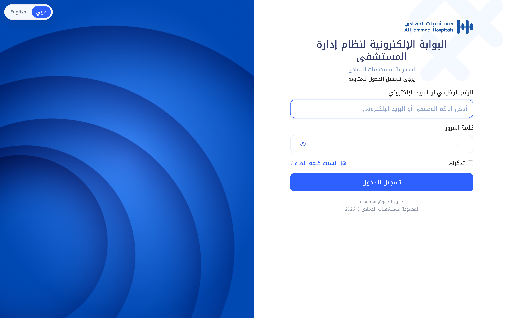


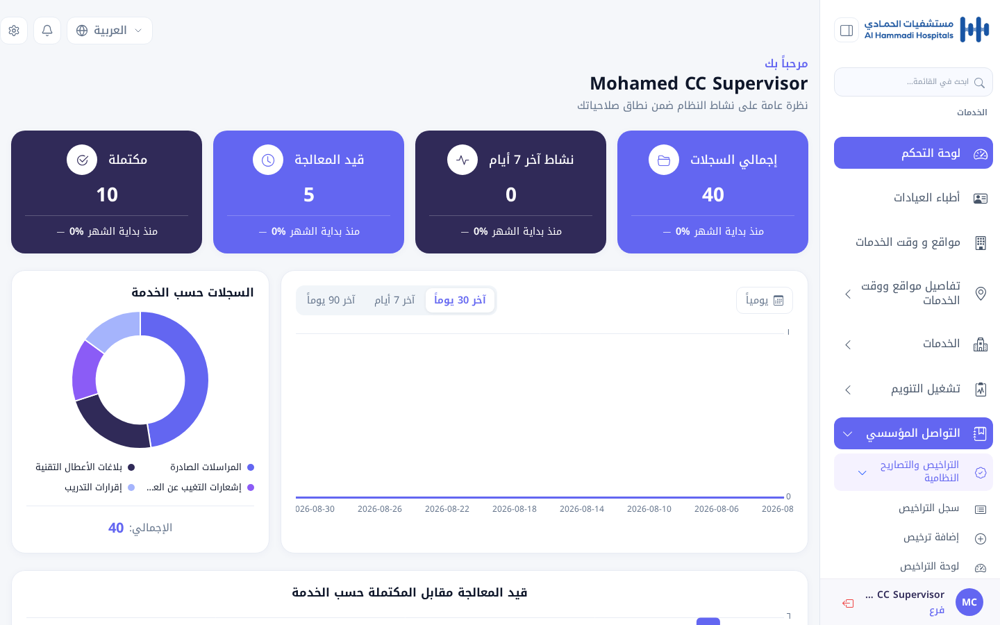

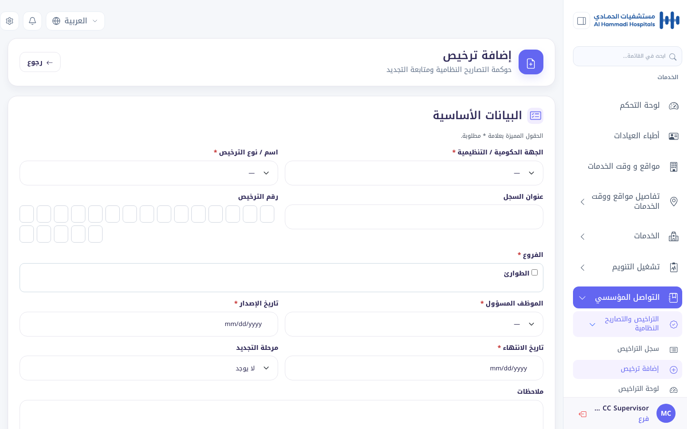

---

# الجزء الأول — التجربة العملية (بيدك)

## الخطوة 1 — مشرف: إنشاء ترخيص جديد

**الحساب:** `lic_cc_super_mohamed`

**لماذا هذه الخطوة؟**  
هنا يبدأ السجل الرسمي للترخيص في النظام — مع المستندات والمسؤول والتواريخ.

**أين في النظام؟**  
**التواصل المؤسسي ← التراخيص ← إضافة ترخيص**


1. املأ النموذج **بالقيم التالية حرفياً**:

| الحقل | القيمة التي تدخلها |
|-------|-------------------|
| الجهة المصدرة | **وزارة الصحة** |
| نوع الترخيص | **ترخيص منشأة صحية** |
| عنوان الترخيص | **ترخيص تجريبي — مراجعة العميل** |
| رقم الترخيص | **20260831001** |
| الفرع | ✅ فعّل **الطوارئ** (أول فرع في القائمة) |
| المسؤول عن الترخيص | **Mohamed License Responsible** |
| تاريخ الإصدار | **2026-01-15** |
| تاريخ الانتهاء | **2027-01-15** |
| ملاحظات | **تجربة عملية — إنشاء من دليل المراجعة** |
| مرفق | أي ملف **PDF** من جهازك (مثلاً نسخة الطلب) |

2. اضغط **حفظ**

> **💡 نصيحة:** المرفق الذي ترفعه هنا سيظهر للمسؤول **قبل** قبول التعهد — لمراجعته واتخاذ قرار القبول أو الرفض.

**النتيجة المتوقعة:**
- يُنشأ الترخيص برقم `20260831001`
- يُرسَل إشعار للمسؤول لقبول التعهد
- يمكنك فتح صفحة الترخيص ورؤية المرفق في قسم **المستندات**

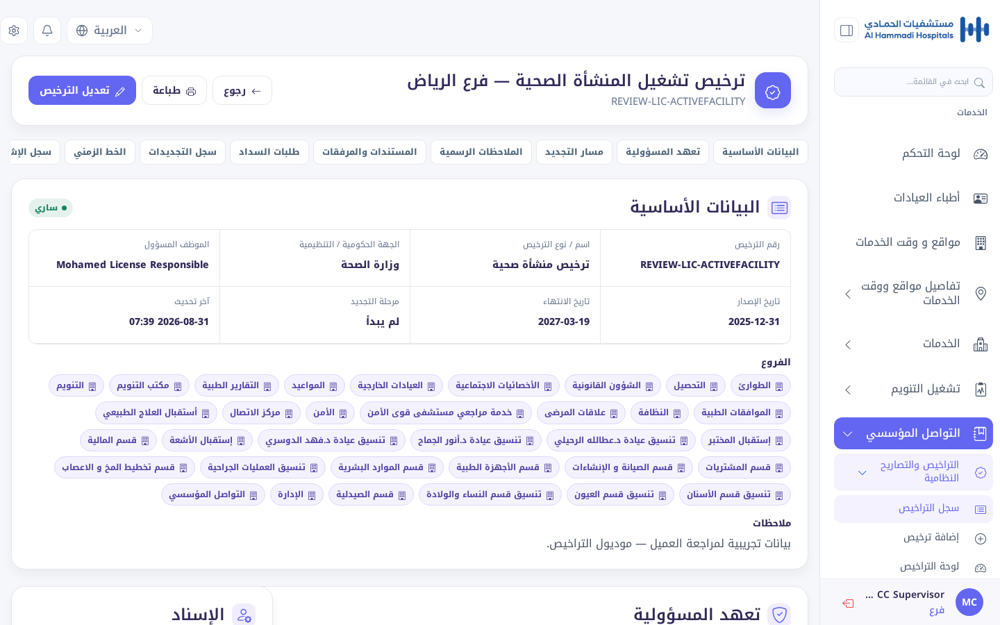

---

## الخطوة 2 — مشرف: تعيين المسؤول (اختياري)

**الحساب:** `lic_cc_super_mohamed`

**لماذا هذه الخطوة؟**  
لتغيير المسؤول بعد الإنشاء — مفيدة إذا أُسند الترخيص لشخص خاطئ.

> **إذا اخترت المسؤول في الخطوة 1 — تخطَّ هذه الخطوة.**

**أين في النظام؟**  
افتح الترخيص `20260831001` → الشريط الجانبي → **الإسناد**

1. اختر **Mohamed License Responsible**
2. اضغط **إعادة إسناد الترخيص**

**النتيجة المتوقعة:** حالة التعهد = **بانتظار القبول** — ويُرسَل إشعار للمسؤول الجديد.


---

## الخطوة 3 — مشرف: تسجيل الخروج

**لماذا؟**  
الخطوة التالية تُنفَّذ بحساب **المسؤول** — يجب تبديل الحساب.

من قائمة المستخدم (أسفل القائمة الجانبية) → **تسجيل الخروج**  
أو افتح **نافذة خاصة / Incognito** للدور التالي.

---

## الخطوة 4 — مسؤول: مراجعة المرفقات + قبول أو رفض التعهد

**الحساب:** `lic_responsible_mohamed`

**لماذا هذه الخطوة؟**  
التعهد = تأكيد رسمي من الموظف المسؤول أنه سيتابع الترخيص قبل انتهائه. **بدون قبول التعهد لا تُفعَّل** أزرار التجديد والسداد.

**أين في النظام؟**  
**التراخيص ← قائمة التراخيص** → افتح `20260831001`  
→ ستُوجَّه تلقائياً لصفحة **التعهد**


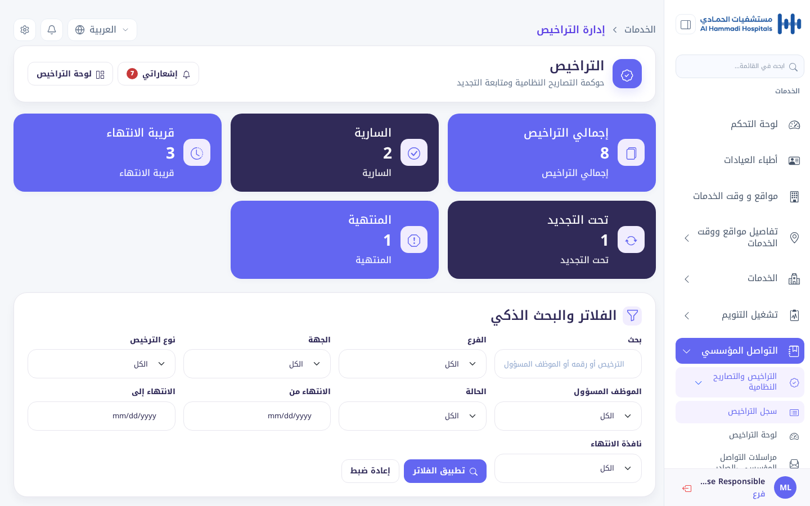

> **لتجربة صفحة التعهد على بيانات جاهزة:** افتح الترخيص `9001000007` (تعهد pending).

**ماذا تفعل على صفحة التعهد؟**

1. **راجع قسم «مرفقات طلب الترخيص»** — حمّل PDF الذي رفعه المشرف (زر **تنزيل**)
2. اقرأ نص التعهد
3. اختر أحد الخيارين:

| الخيار | متى تستخدمه | الإجراء |
|--------|-------------|---------|
| **قبول** | المرفقات والمسؤولية واضحة | ✅ فعّل «قرأت نص التعهد وأوافق عليه» → **قبول التعهد** |
| **رفض** | المرفق ناقص أو الإسناد خاطئ | اكتب سبباً (اختياري) → **رفض التعهد** → يُبلَّغ المشرف لإعادة الإسناد |

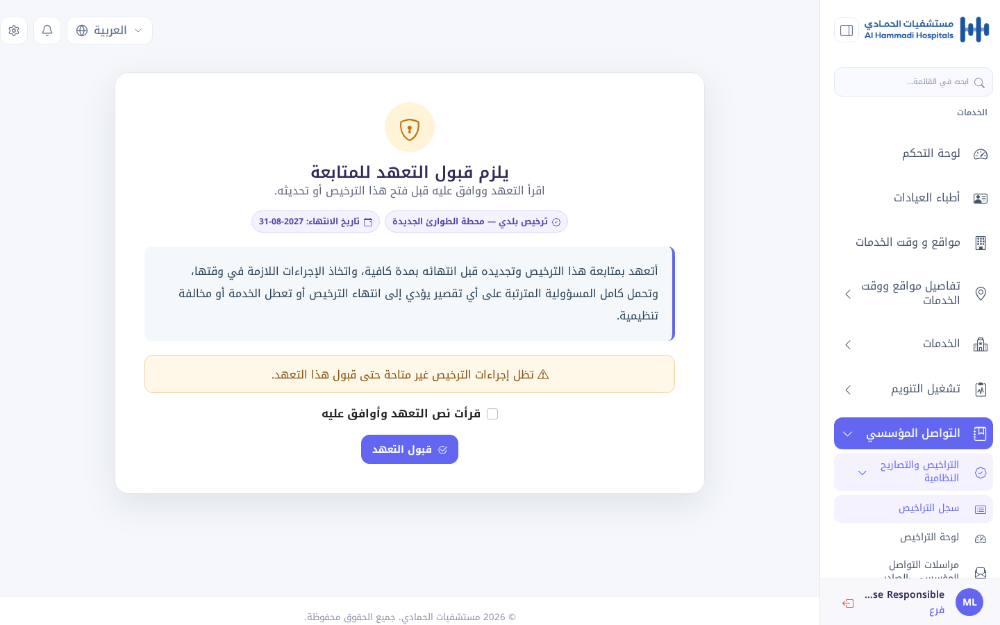

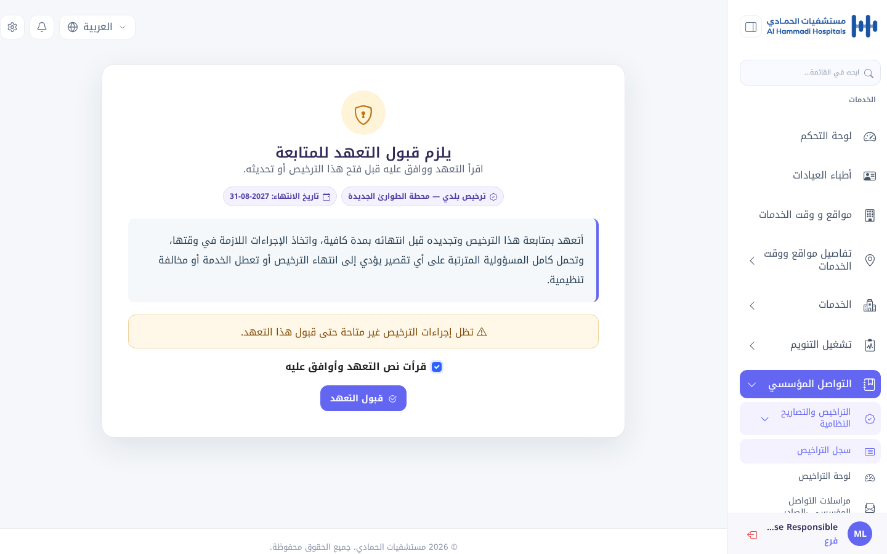

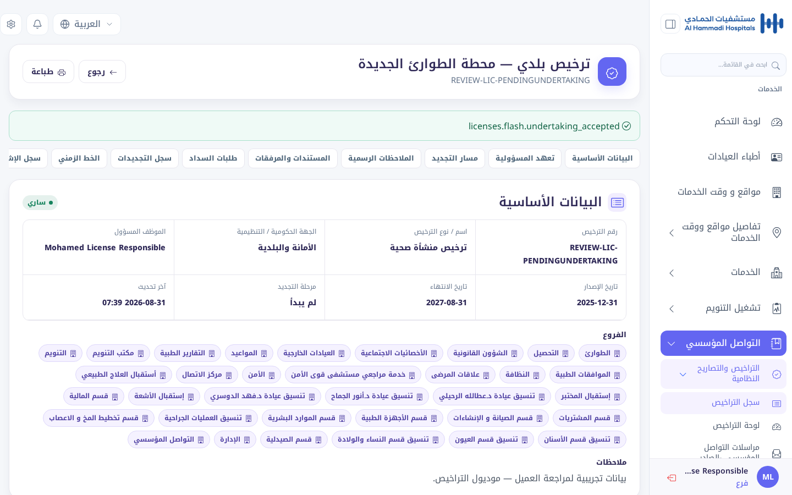

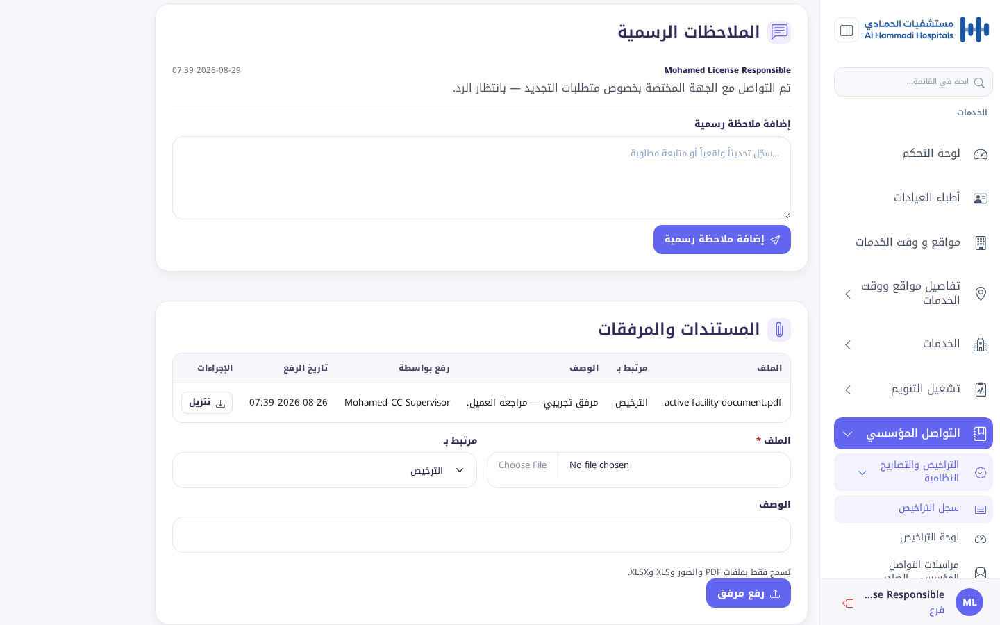

**النتيجة المتوقعة (عند القبول):**
- حالة التعهد = **تم القبول**
- تُفعَّل أقسام المعالجة في صفحة الترخيص (تجديد، سداد، ملاحظات)

**النتيجة المتوقعة (عند الرفض):**
- تُعاد للقائمة مع رسالة تأكيد
- المشرف يستلم إشعاراً — يمكنه إعادة الإسناد أو تصحيح البيانات

---

## الخطوة 5 — مسؤول: ملاحظة رسمية + مرفق إضافي

**الحساب:** `lic_responsible_mohamed`

**لماذا هذه الخطوة؟**  
توثيق المتابعة الرسمية — كل ملاحظة ومرفق يُسجَّل في **السجل الزمني** للمراجعة لاحقاً.

**أين في النظام؟**  
صفحة الترخيص `20260831001` — انتقل لكل قسم:

### أ) الملاحظات الرسمية

| الحقل | القيمة |
|-------|--------|
| الملاحظة | **تم التواصل مع الجهة بخصوص متطلبات التجديد — تجربة العميل** |

→ **إضافة ملاحظة رسمية**

### ب) المستندات والمرفقات

| الحقل | القيمة |
|-------|--------|
| الملف | أي **PDF** |
| الوصف | **نسخة الترخيص — تجربة العميل** |

→ **رفع مرفق**

**النتيجة المتوقعة:** تظهر الملاحظة والمرفق في الصفحة — ويظهر حدث جديد في **السجل الزمني**.

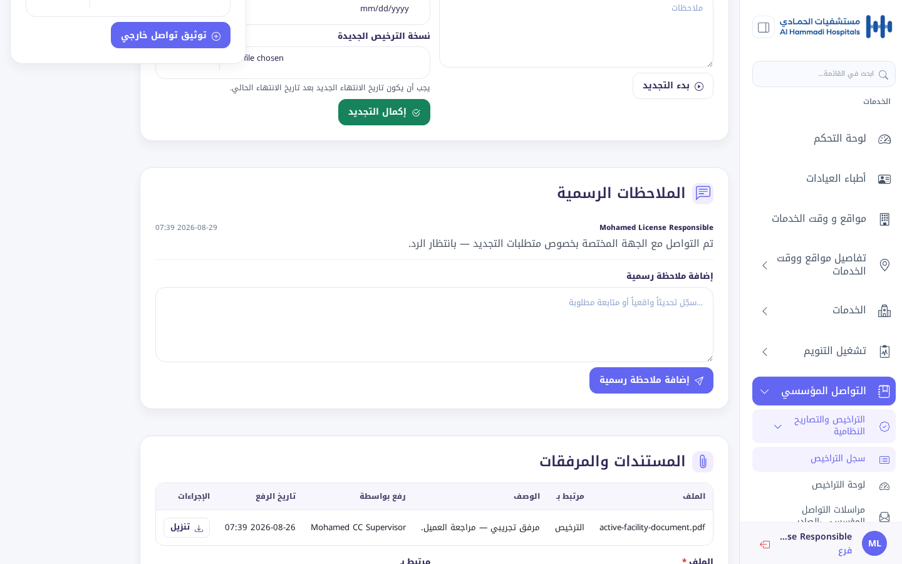


---

## الخطوة 6 — مسؤول: بدء التجديد

**الحساب:** `lic_responsible_mohamed`

**لماذا هذه الخطوة؟**  
عند اقتراب انتهاء الترخيص يُسجَّل في النظام أن التجديد **بدأ** — مع مرحلة واضحة (مثل: جارٍ التجهيز).

**أين في النظام؟**  
صفحة الترخيص → قسم **التجديد**

| الإجراء | القيمة |
|---------|--------|
| ملاحظات بدء التجديد | **بدء تجديد تجريبي — مراجعة العميل** |
| → اضغط | **بدء التجديد** |
| مرحلة التجديد | **جارٍ التجهيز** |
| → اضغط | **تحديث المرحلة** |

**النتيجة المتوقعة:** حالة الترخيص = **تحت التجديد** — ولون/شارة الحالة تتغيّر في القائمة.

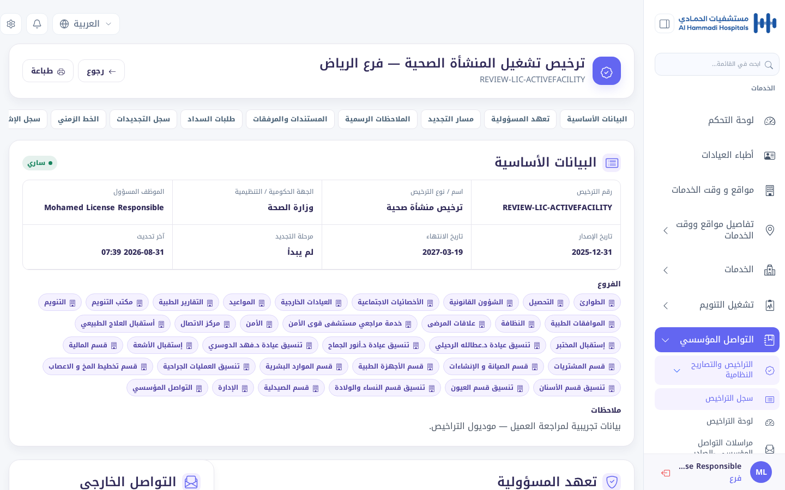

---

## الخطوة 7 — مسؤول: إنشاء طلب سداد

**الحساب:** `lic_responsible_mohamed`

**لماذا هذه الخطوة؟**  
رسوم التجديد تمرّ عبر **مالية التراخيص** — المسؤول يفتح الطلب، والمالية تُحدّث الحالة حتى «تم السداد».

**أين في النظام؟**  
صفحة الترخيص → قسم **طلبات السداد**

| الحقل | القيمة |
|-------|--------|
| المبلغ | **4500** |
| العملة | **SAR** |
| اسم البنك | **البنك الأهلي — حساب التراخيص** |
| رقم الفاتورة | **20260831002** |
| تفاصيل التحويل | **رسوم تجديد ترخيص — تجربة العميل** |
| ملاحظات | **طلب سداد تجريبي** |
| مرفق | أي **PDF** (فاتورة) |

→ **إنشاء طلب سداد**

> **💡 نصيحة:** احفظ **رقم الفاتورة** `20260831002` — ستستخدمه في الخطوة 9 للبحث في شاشة المالية.

**النتيجة المتوقعة:** يظهر الطلب بحالة **تم استلام الطلب** — سجّل رقم الطلب الظاهر.

---

## الخطوة 8 — مسؤول: تسجيل الخروج

نفس الخطوة 3 — استعد لدخول **مدير المالية**.

---

## الخطوة 9 — مالية: معالجة السداد

**الحساب:** `lic_finance_bader`

**لماذا هذه الخطوة؟**  
المالية تؤكد أن الدفع تم — ويرفع **إثبات السداد** — فيُكمل المسؤول التجديد.

**أين في النظام؟**  
**التراخيص ← مالية التراخيص**

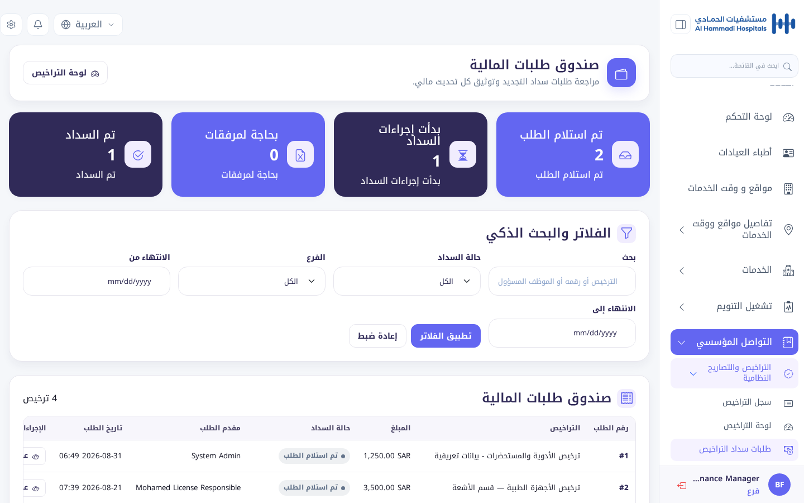

1. افتح طلب **20260831002** (الذي أنشأته في الخطوة 7)  
   — أو للاطلاع على بيانات جاهزة: طلب **#2** / فاتورة **9002000004**
2. غيّر الحالة **بالترتيب**:

| الترتيب | ماذا تختار | ماذا تفعل |
|---------|------------|-----------|
| 1 | **تم البدء بإجراءات السداد** | **حفظ التعديلات** |
| 2 | **تم السداد** | أرفق **PDF إثبات دفع** → **حفظ التعديلات** |

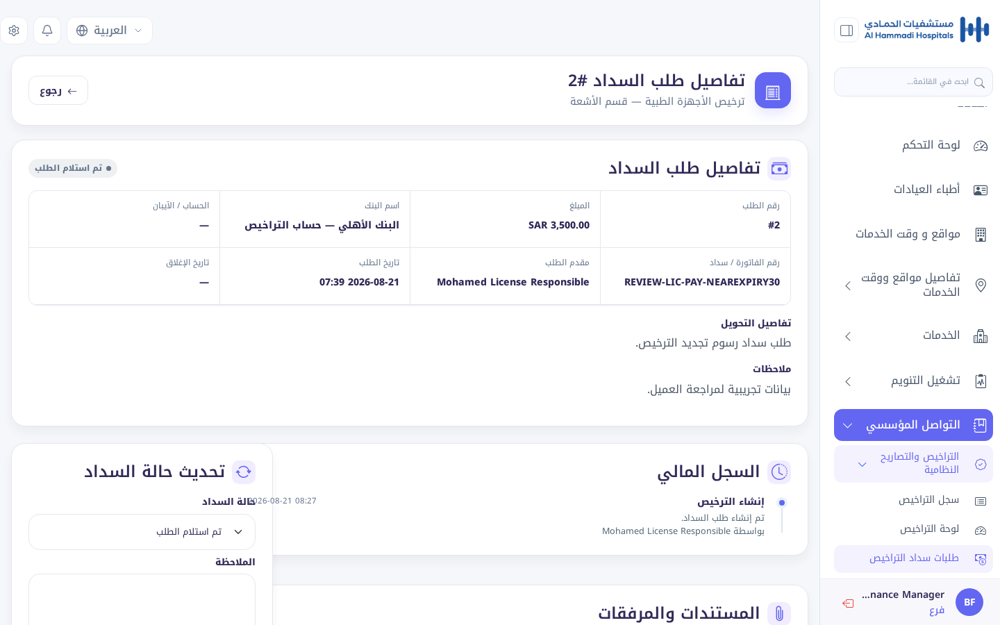

**النتيجة المتوقعة:** الطلب = **تم السداد** + إشعار للمسؤول.

---

## الخطوة 10 — مسؤول: إكمال التجديد

**الحساب:** `lic_responsible_mohamed`

**لماذا هذه الخطوة؟**  
بعد السداد يُحدَّث **تاريخ الانتهاء الجديد** ويُرفَق الترخيص المجدَّد — دورة التجديد تُغلَق.

**أين في النظام؟**  
افتح `20260831001` → قسم **التجديد**

| الحقل | القيمة |
|-------|--------|
| تاريخ الانتهاء الجديد | **2028-01-15** |
| نسخة الترخيص المجدَّد | أي **PDF** |

→ **إكمال التجديد**

**النتيجة المتوقعة:** تاريخ الانتهاء يتحدّث إلى **2028-01-15** — والحالة تعود **ساري**.


---

## الخطوة 11 — مسؤول: مراجعة السجل والإشعارات

**الحساب:** `lic_responsible_mohamed`

**لماذا هذه الخطوة؟**  
للتأكد أن **كل حركة** سُجِّلت: من أنشأ، من قبل التعهد، من طلب السداد، إلخ.

1. في صفحة الترخيص → **السجل الزمني** — تأكد من: إنشاء، تعهد، تجديد، سداد
2. **التراخيص ← إشعاراتي** — تأكد من إشعارات التعهد والسداد

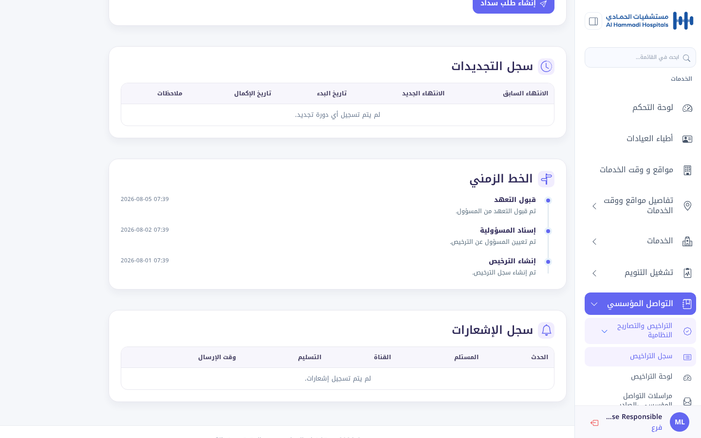

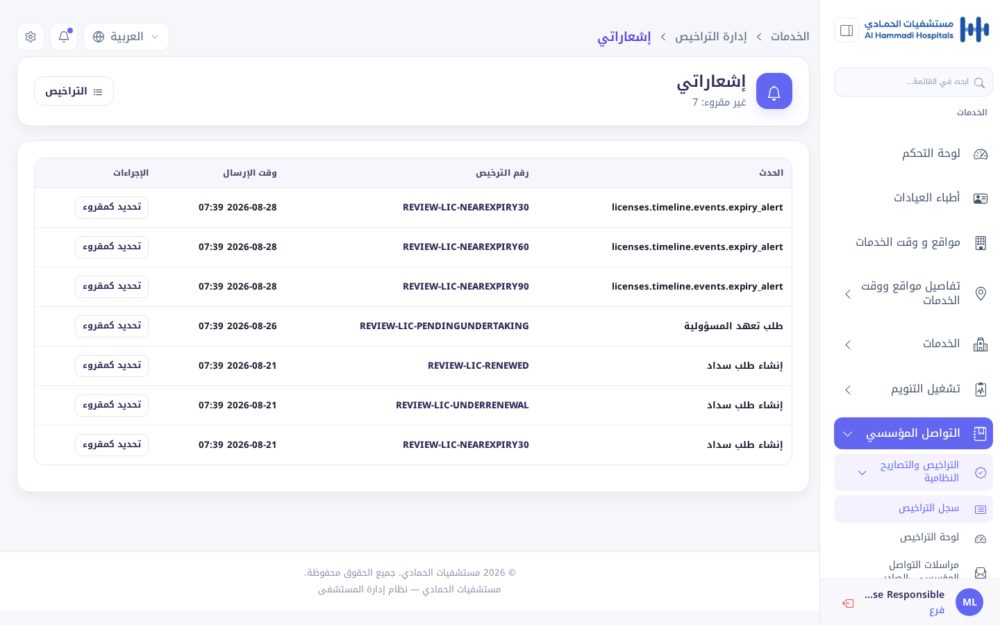

**النتيجة المتوقعة:** سجل كامل بكل الأحداث مع التاريخ والمسؤول.

---

## الخطوة 12 — Super Admin: تصدير تقرير

**الحساب:** `lic_super_bader`

**لماذا هذه الخطوة؟**  
لإخراج **تقرير رسمي** (PDF/Excel) يمكن مشاركته مع الإدارة أو التدقيق.

**أين في النظام؟**  
**التراخيص ← قائمة التراخيص**

1. اضغط **تصدير PDF** ثم **تصدير Excel**
2. افتح **لوحة التراخيص** للإحصائيات

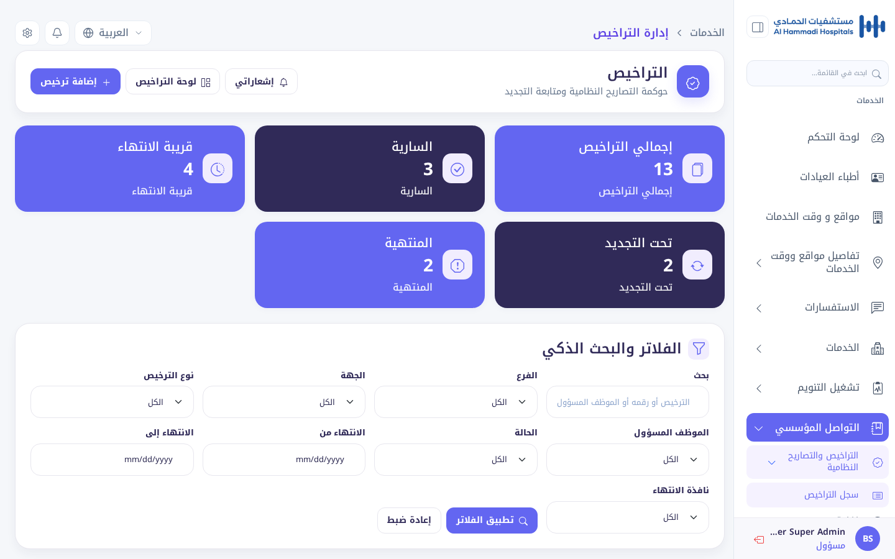

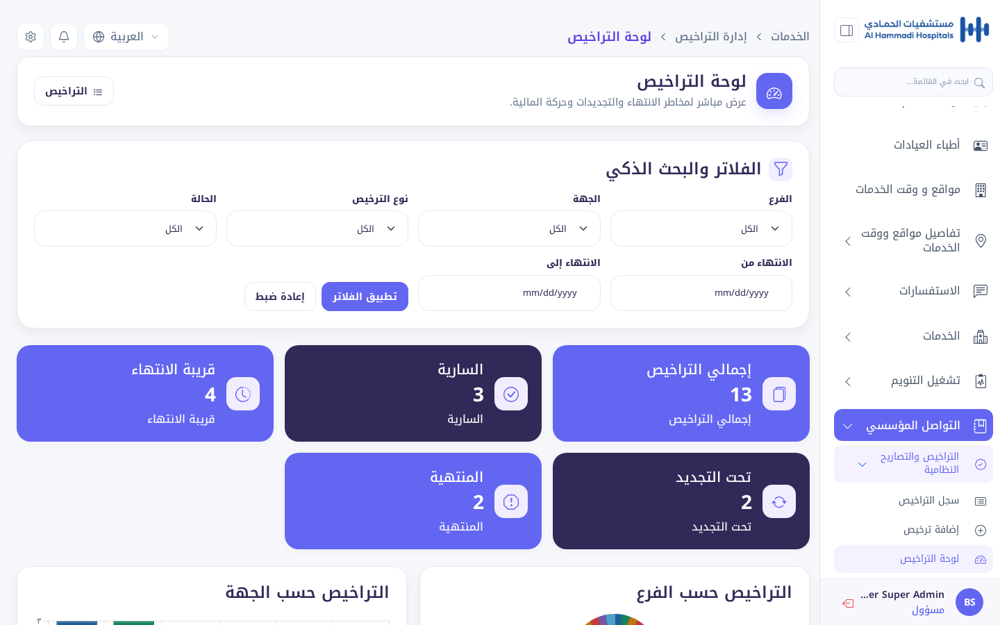

**النتيجة المتوقعة:** يُحمَّل ملف التقرير ويظهر `20260831001` في القائمة.

---

# الجزء الثاني — تجربة سريعة (بيانات جاهزة)

> **متى تستخدم هذا الجزء؟**  
> إذا أردت **الاطلاع فقط** على حالات مختلفة (منتهي، قريب الانتهاء، تعهد pending…) **بدون** إنشاء ترخيص جديد.

ابحث برقم الترخيص في **قائمة التراخيص** أو **البحث الذكي**:

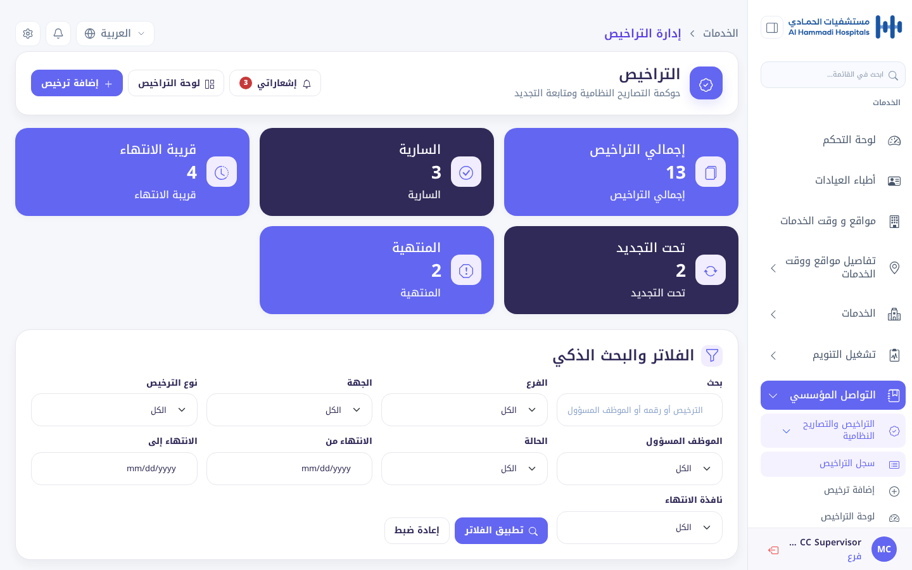


| # | ماذا ستشاهد | الحساب | رقم الترخيص |
|---|-------------|--------|-------------|
| أ | ترخيص ساري | `lic_responsible_mohamed` | `9001000001` |
| ب | قريب الانتهاء (90 يوم) | `lic_responsible_mohamed` | `9001000002` |
| ج | قريب الانتهاء (60 يوم) | `lic_responsible_mohamed` | `9001000003` |
| د | 30 يوم + طلب سداد | `lic_responsible_mohamed` / `lic_finance_bader` | `9001000004` — فاتورة `9002000004` |
| هـ | تحت التجديد | `lic_responsible_mohamed` | `9001000005` |
| و | منتهي | `lic_responsible_mohamed` | `9001000006` |
| **ز** | **تعهد pending + مرفقات** | `lic_responsible_mohamed` | **`9001000007`** |
| ح | تجديد مكتمل | `lic_finance_bader` | `9001000008` |

> **💡 للتعهد:** افتح `9001000007` — ستجد المرفقات قبل القبول، ويمكنك تجربة **القبول** أو **الرفض**.

---

# الجزء الثالث — ماذا يقدّم الموديول؟

بعد الخطوات 1–12 يكون ترخيص `20260831001` مرّ بالمسار الكامل:

```
إنشاء → تعيين → تعهد → ملاحظات → تجديد → سداد → إكمال → تقرير
```


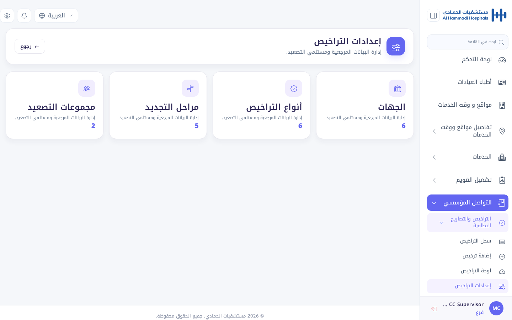

| القدرة | أين تجدها في القائمة |
|--------|---------------------|
| لوحة إحصائيات ومخاطر الانتهاء | التراخيص ← **لوحة التراخيص** |
| بحث وفلترة | التراخيص ← **قائمة التراخيص** |
| إنشاء وتعيين مسؤول | **إضافة ترخيص** + قسم الإسناد |
| تعهد + مرفقات + قبول/رفض | صفحة **التعهد** عند أول زيارة |
| تجديد ومراحل | قسم **التجديد** |
| طلبات السداد | قسم **طلبات السداد** + **مالية التراخيص** |
| تنبيهات 90/60/30 يوم | تلقائية + **إشعاراتي** + السجل الزمني |
| تصدير PDF/Excel | أزرار التصدير في القائمة |
| إعدادات (جهات، أنواع، تصعيد) | التراخيص ← **إعدادات** |

---

## checklist — تأكد أنكم جربتم

- [ ] تسجيل دخول `lic_cc_super_mohamed` + ظهور **Mohamed License Responsible**
- [ ] إنشاء ترخيص `20260831001` (أرقام فقط) + رفع PDF
- [ ] قبول التعهد (أو تجربة الرفض على `9001000007`)
- [ ] تنزيل مرفق المشرف من صفحة التعهد
- [ ] ملاحظة + مرفق + بدء تجديد
- [ ] طلب سداد `20260831002` بمبلغ **4500**
- [ ] معالجة السداد من `lic_finance_bader`
- [ ] إكمال التجديد → تاريخ **2028-01-15**
- [ ] مراجعة السجل الزمني + الإشعارات
- [ ] تصدير PDF/Excel

---

## أسئلة شائعة — إجابات مباشرة

**س: لم أستلم OTP؟**  
ج: راجع **Spam** في `bader_alhajji@hotmail.com`. تأكد أنك تدخل **اسم المستخدم** (مثل `lic_cc_super_mohamed`) وليس البريد.

**س: لا أرى الترخيص في القائمة؟**  
ج: **المسؤول** يرى تراخيصه المُسندة له فقط. **المشرف** يرى الكل. تأكد من الحساب الصحيح.

**س: لا أستطيع الضغط على «بدء التجديد» أو «طلب سداد»؟**  
ج: يجب **قبول التعهد** أولاً (الخطوة 4). إذا **رفضت** التعهد — انتظر إعادة الإسناد من المشرف.

**س: تحميل PDF يعطي خطأ؟**  
ج: استخدم زر **تنزيل** من صفحة التعهد أو قسم المرفقات — لا تفتح الرابط في تبويب قديم بعد تسجيل الخروج.

**س: رفض النظام رقم الترخيص؟**  
ج: **أرقام فقط** — مثال: `20260831001` (بدون حروف أو `-`).

**س: لا أجد Mohamed License Responsible؟**  
ج: يجب الدخول بحساب **`lic_cc_super_mohamed`**. ابحث بالاسم **الظاهر** في القائمة — ليس اسم المستخدم.

**س: الحساب غير موجود؟**  
ج: الحسابات الأربعة (`lic_cc_super_mohamed`, `lic_responsible_mohamed`, `lic_finance_bader`, `lic_super_bader`) **مُفعَّلة على السيرفر**. استخدم **اسم المستخدم** من الجدول — لا البريد.

---

*نهاية دليل التجربة العملية — موديول إدارة التراخيص — الإصدار 2.5*
